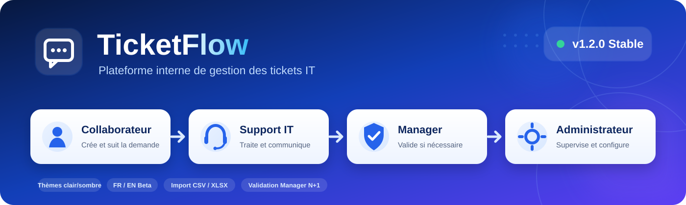

<p align="center">
  
</p>

<p align="center">
  <strong>TicketFlow v1.2.0 — Stable</strong><br>
  Plateforme web interne de gestion des tickets IT en PHP, Apache et MariaDB/MySQL.
</p>

<p align="center">
  
  
  
  
  
</p>

---

## À propos

**TicketFlow** est une application web interne conçue pour centraliser les demandes et incidents IT d'une entreprise. Elle propose quatre rôles distincts : **Administrateur**, **Support IT**, **Manager** et **Collaborateur**, avec des droits et workflows adaptés à chacun.

La version **v1.2.0 Stable** ajoute les thèmes par utilisateur, le multilingue FR/EN, l'import CSV/XLSX, une validation Manager à deux niveaux, le changement forcé du mot de passe modernisé et de nombreuses améliorations de l'interface.

## Nouveautés v1.2.0

- thème clair, sombre ou système mémorisé par utilisateur ;
- thème clair par défaut pour les nouveaux comptes ;
- interface Français / English, avec anglais indiqué comme bêta ;
- changement forcé du mot de passe via une fenêtre bloquante sécurisée ;
- assistant `setup.php` entièrement redesigné ;
- rôle visible **Support IT** tout en conservant la clé technique interne `IT` ;
- validation Manager à deux niveaux : N+1 puis Manager sélectionné par le Support IT ;
- import massif d'utilisateurs CSV / XLSX avec prévisualisation et contrôles ;
- modèles CSV et Excel téléchargeables ;
- lecteur et générateur XLSX renforcés pour Microsoft Excel ;
- calendriers TicketFlow personnalisés avec saisie manuelle ;
- conversations et pièces jointes améliorées ;
- historique des alertes de service modernisé ;
- nombreux correctifs de contraste, de traduction et d'ergonomie.

## Fonctionnalités principales

- gestion complète des tickets : incidents, requêtes et changements ;
- rôles **Administrateur / Support IT / Manager / Collaborateur** ;
- assignation et suivi des tickets par les équipes Support IT ;
- validation Manager à deux niveaux lorsqu'une demande le nécessite ;
- conversation dans le ticket sans rechargement complet ;
- notes internes Support IT ;
- pièces jointes sécurisées ;
- notifications internes ;
- SLA et alertes ;
- recherche globale et filtres avancés ;
- vues enregistrées et actions multiples ;
- exports utilisateurs, tickets et opérations ;
- import utilisateurs CSV / XLSX ;
- statistiques et journal d'audit ;
- gestion des groupes et responsables ;
- paramètres utilisateur, avatar, thème, densité, menu et langue ;
- file e-mail, rappels et automatisations ;
- alertes de service globales ;
- mode maintenance et maintenances planifiées ;
- scripts de diagnostic, sécurité, migration et mise à jour ;
- installation automatisée sur Debian/Ubuntu.

## Installation sur Debian / Ubuntu

### 1. Préparer le serveur

Sur une Debian/Ubuntu propre :

```bash
apt update
apt install apache2 mariadb-server php php-mysql php-mbstring php-zip php-xml php-curl curl sudo
```

### 2. Installer TicketFlow automatiquement

> Cette commande est destinée à une **nouvelle installation**.

```bash
curl -fsSL https://raw.githubusercontent.com/blueGameTV/TicketFlow/main/install.sh | sudo bash
```

L'installateur prend automatiquement en charge :

- les dépendances nécessaires ;
- Apache et son VirtualHost ;
- MariaDB et la base `ticketflow` ;
- l'utilisateur SQL applicatif ;
- la génération de `config/config.php` ;
- les permissions de `storage/` ;
- les limites PHP pour les pièces jointes ;
- le cron TicketFlow ;
- la désactivation du site Apache Debian par défaut.

À la fin, une URL sécurisée est affichée :

```text
http://IP_DU_SERVEUR/setup.php?token=...
```

Ouvrez-la pour créer le **premier compte Administrateur**. Après validation, TicketFlow crée `storage/installed.lock`, supprime le jeton d'installation et verrouille automatiquement l'assistant.

## Mise à jour d'une installation existante

TicketFlow peut être mis à jour **sur place**, sans réinstaller Apache, PHP ou MariaDB.

La commande suivante prend en charge directement les installations **v1.0.0**, **v1.1.0** et les préversions v1.2 :

```bash
curl -fsSL https://raw.githubusercontent.com/blueGameTV/TicketFlow/main/update.sh | sudo bash
```

Le script :

- vérifie que l'installation actuelle est bien un dépôt Git TicketFlow ;
- corrige automatiquement les anciens changements de mode sur les fichiers `storage/**/.gitkeep` ;
- refuse la mise à jour si de vrais fichiers applicatifs suivis ont été modifiés localement ;
- sauvegarde automatiquement `config/config.php` ;
- sauvegarde la base MariaDB/MySQL ;
- sauvegarde `storage/uploads/` ;
- récupère la dernière version stable depuis `main` ;
- applique automatiquement **v1.1.0 puis v1.2.0** lorsqu'une installation v1.0.0 est détectée ;
- applique uniquement la migration v1.2.0 depuis v1.1.0 ;
- conserve les comptes, tickets, groupes, paramètres, pièces jointes et données existantes ;
- lance les contrôles de santé et de routes ;
- recharge Apache.

Les sauvegardes sont placées par défaut dans :

```text
/var/backups/ticketflow/
```

Consultez [docs/upgrade.md](docs/upgrade.md) pour le détail des chemins de migration.

## Connexion

Après installation :

```text
http://IP_DU_SERVEUR/login.php
```

Connectez-vous avec le compte Administrateur créé lors de l'assistant initial.

## Rôles

| Rôle | Fonction principale |
| --- | --- |
| **Administrateur** | Gestion des utilisateurs, groupes, configuration, imports, exports, statistiques, audit, alertes, maintenance et supervision globale |
| **Support IT** | Traitement, assignation, échanges, validation Manager, résolution des tickets et alertes de service |
| **Manager** | Création de tickets personnels et validation des demandes qui lui sont soumises |
| **Collaborateur** | Création, suivi et confirmation de résolution de ses propres tickets |

## Workflow de validation Manager v1.2

```text
Support IT
    │
    ├── sélectionne le Manager final
    │
    ▼
Manager N+1 du demandeur
    │
    ├── Refuse / demande des informations ──► fin de la chaîne
    │
    └── Valide
          │
          ▼
Manager sélectionné
    │
    ├── Valide
    └── Refuse / demande des informations
```

Le Manager sélectionné n'est notifié qu'après validation du N+1.

## Vérification de l'installation

Depuis le serveur :

```bash
cd /var/www/ticketflow
php scripts/healthcheck.php
php scripts/security_audit.php
php scripts/release_check.php
php scripts/route_check.php
php scripts/rc_preflight.php
```

## Configuration

Le fichier local utilisé par TicketFlow est :

```text
config/config.php
```

Il ne doit **jamais** être envoyé sur GitHub. Le modèle public est `config/config.example.php`.

## E-mails

TicketFlow prend en charge :

- `disabled` : e-mails désactivés ;
- `log` : simulation dans `storage/logs/mail.log` ;
- `smtp` : envoi via un serveur SMTP configuré.

Le mode `log` est recommandé pour les environnements de test.

## Tâches automatiques

Le cron principal est exécuté toutes les cinq minutes :

```cron
*/5 * * * * www-data /usr/bin/php /var/www/ticketflow/scripts/cron/run.php >> /var/www/ticketflow/storage/logs/cron.log 2>&1
```

Il gère notamment les SLA, rappels, automatisations, nettoyage et file e-mail.

## Structure du projet

```text
.github/        modèles GitHub
config/         configuration et modèle public
database/       schéma SQL et migrations
deploy/         configuration de déploiement
docs/           documentation
lang/           traductions FR / EN
public/         DocumentRoot Apache et interface web
scripts/        migrations, cron, diagnostics et maintenance
src/            logique applicative et services
storage/        logs, uploads et données runtime
templates/      composants d'interface partagés
install.sh      nouvelle installation automatisée
update.sh       mise à jour sécurisée d'une installation existante
```

## Sécurité

TicketFlow inclut notamment :

- `password_hash()` / `password_verify()` ;
- protection CSRF ;
- contrôle des rôles côté serveur ;
- vérification des droits d'accès aux tickets ;
- pièces jointes stockées hors du dossier public ;
- sessions PHP durcies ;
- limitation des tentatives de connexion ;
- journal d'audit ;
- en-têtes HTTP de sécurité ;
- changement forcé du mot de passe ;
- verrouillage automatique de l'assistant d'installation ;
- sauvegarde automatique avant mise à jour avec `update.sh`.

La branche **v1.2.x** est la branche stable recommandée. Les installations **v1.0.x** et **v1.1.x** doivent être mises à jour vers la dernière v1.2.x.

Consultez [SECURITY.md](SECURITY.md) pour les informations de sécurité.

## Documentation

- [Installation](docs/installation.md)
- [Déploiement Apache](docs/deployment-apache.md)
- [Mise à niveau](docs/upgrade.md)
- [Rôles et permissions](docs/roles-permissions.md)
- [Workflow des tickets](docs/ticket-workflow.md)
- [E-mails et automatisations](docs/v014-mail-automation.md)
- [SLA](docs/sla.md)
- [Exports](docs/exports.md)
- [Notifications](docs/notifications.md)
- [Statistiques](docs/statistics.md)
- [Architecture](docs/architecture.md)
- [Notes de version v1.2.0](docs/release-notes-v120.md)
- [Notes de version v1.1.0](docs/release-notes-v110.md)

## Contribution

Les règles de contribution sont disponibles dans [CONTRIBUTING.md](CONTRIBUTING.md).

## Version

**TicketFlow v1.2.0 Stable**

---

<p align="center">
  <strong>TicketFlow</strong> — Gestion des tickets IT simple, structurée et centralisée.
</p>
